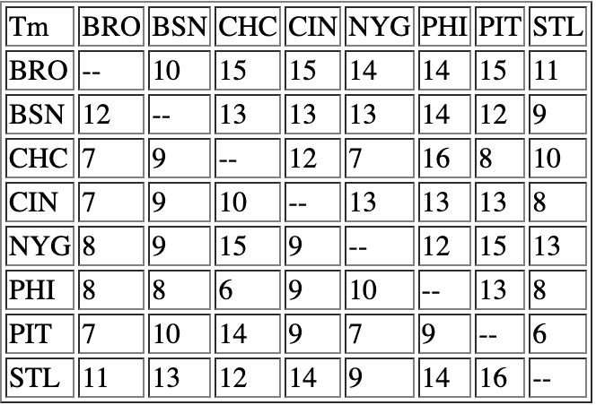

this repository is the solution to Sports Reference Engineering Internship Prompt.

To view the result, preview table.html.
To run the code yourself, run tsc on your terminal.

It includes:
* data.json: stores the example json data provided with the prompt.
* solution.ts: this is the solution displaying my ability to work with data structures, loops, and logic. It renders the table for the desired result. when compiled, outputs solution.js for the table.
* tsconfig.json: has the configuration for TypeScript compilation.
* table.html: uses the solution.js created by solution.ts to display the table on the browser.

For any additional questions: bilgebengisu1@gmail.com

The resulting table:

